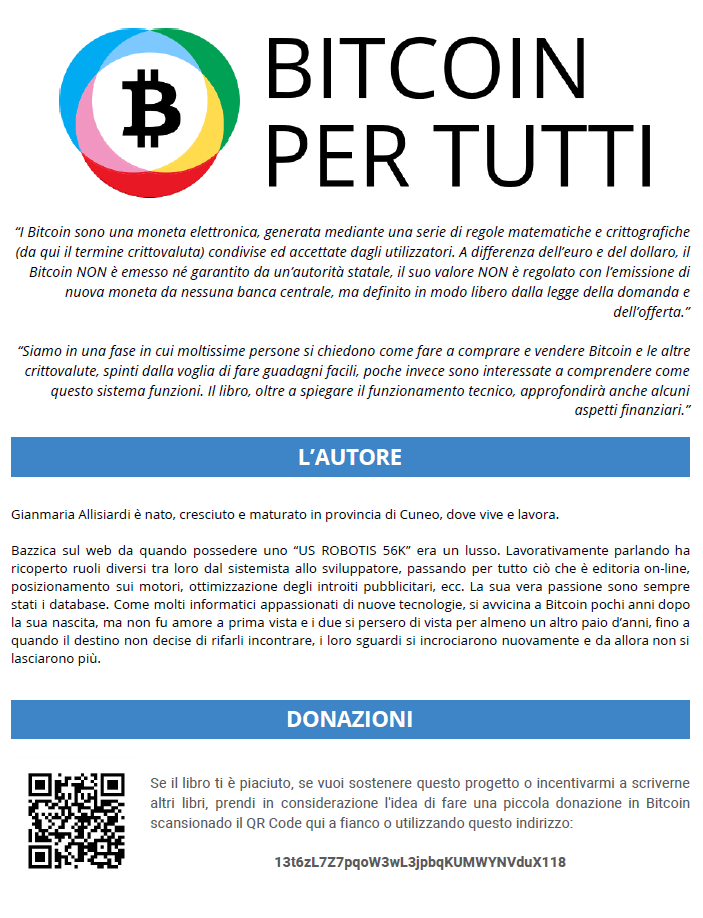

:autore: Gianmaria Allisiardi
:sito: https://www.bitcoinpertutti.org
:github: https://github.com/gallisiardi/bitcoinpertutti
:download: https://www.bitcoinpertutti.org/download.php
:contatti: https://www.bitcoinpertutti.org/contatti.php
:donazioni: https://www.bitcoinpertutti.org/donazioni.php
:donazioneaddress: 13t6zL7Z7pqoW3wL3jpbqKUMWYNVduX118

ifdef::env-github[]
:tip-caption: :bulb:
:note-caption: :information_source:
:important-caption: :heavy_exclamation_mark:
:caution-caption: :fire:
:warning-caption: :warning:
endif::[]

ifdef::env-github[]
:imagesdir: /
endif::[]

= **Bitcoin per tutti**, __Bitcoin e le crittovalute spiegate in modo veloce e semplice, alla portata di tutti__
Gianmaria Allisiardi {contatti}
v 0.0.4, {docdate}: Bozza completa in fase di revisione finale
:doctype: book
:icons: font
:homepage: https://www.bitcoinpertutti.org
:experimental:
:sectnums!:
:chapter-label:
:front-cover-image: 
:title-logo-image: 
:back-cover-image: 
:description: Bitcoin e le crittovalute spiegate in modo veloce e semplice, alla portata di tutti.
:keywords:
:reproducible:
:toc:
:toc-title: Indice
:toclevels: 2
:preface-title: .

{empty} +
{empty} +

IMPORTANT: Questo libro è distribuito in forma completamente *GRATUITA*. A questo indirizzo {download} è possibile scaricare la versione aggiornata, con tutte le ultime correzioni ed integrazioni. Github non supporta tutte le funzionalità di Asciidoc, la lettura su questa piattaforma è sconsigliata, in quanto alcuni contenuti non vengono visualizzati in modo corretto.

[.text-center]
*Versione: {revnumber} pubblicata il: {docdate} - {revremark}*

{empty} +
{empty} +

<<<

{empty} +
{empty} +
{empty} +
{empty} +
{empty} +
{empty} +

[quote, Henry Ford,]
Real progress happens only when advantages of a new technology become available to everybody

{empty} +
{empty} +
{empty} +
{empty} +
{empty} +
{empty} +

[quote, Henry Ford,]
C'è vero progresso solo quando i vantaggi di una nuova tecnologia diventano disponibili a tutti

{empty} +
{empty} +
{empty} +
{empty} +
{empty} +
{empty} +

<<<

:sectnums:

include::./includes/002_Prefazione.adoc[Prefazione]

<<<

include::./includes/003_Introduzione.adoc[Introduzione]

<<<

include::./includes/004_Storia_della_moneta_e_nascita_di_Bitcoin.adoc[Storia della moneta e nascita di Bitcoin]

<<<

include::./includes/005_Concetti_informatici_di_base.adoc[Concetti informatici di base]

<<<

include::./includes/006_Come_funziona_Bitcoin.adoc[Come funziona Bitcoin]

<<<

include::./includes/007_La_competizione_tra_i_miner.adoc[La competizione tra i miner]

<<<

include::./includes/008_Caratteristiche_tecniche_e_monetarie.adoc[Caratteristiche tecniche e monetarie]

<<<

include::./includes/009_I_principali_strumenti.adoc[I principali strumenti]

<<<

include::./includes/010_Acquistare_Bitcoin_e_crittovalute.adoc[Acquistare Bitcoin e crittovalute]

<<<

include::./includes/011_Sicurezza_e_privacy.adoc[Sicurezza e privacy]

<<<

include::./includes/012_Aspetti_legali_e_fiscali.adoc[Aspetti legali, contabili e fiscali]

<<<

include::./includes/013_Oltre_al_Bitcoin_c'è_di_più.adoc[Oltre al Bitcoin c'è di più]

<<<

include::./includes/014_Investire_in_crittovalute.adoc[Investire in crittovalute]

<<<

include::./includes/015_Truffe_e_raggiri.adoc[Truffe e raggiri]

<<<

include::./includes/016_Consigli_utili.adoc[Consigli utili]

<<<

include::./includes/017_Link_vari.adoc[Link vari]

<<<

include::./includes/021_Le_mining_pool.adoc[Le mining pool]

<<<

include::./includes/022_I_fork.adoc[I fork]

<<<

include::./includes/023_La_guerra_per_ingrandire_il_blocco.adoc[La guerra per ingrandire il blocco]

<<<

include::./includes/024_Lightning_Network.adoc[Lightning Network]

<<<

